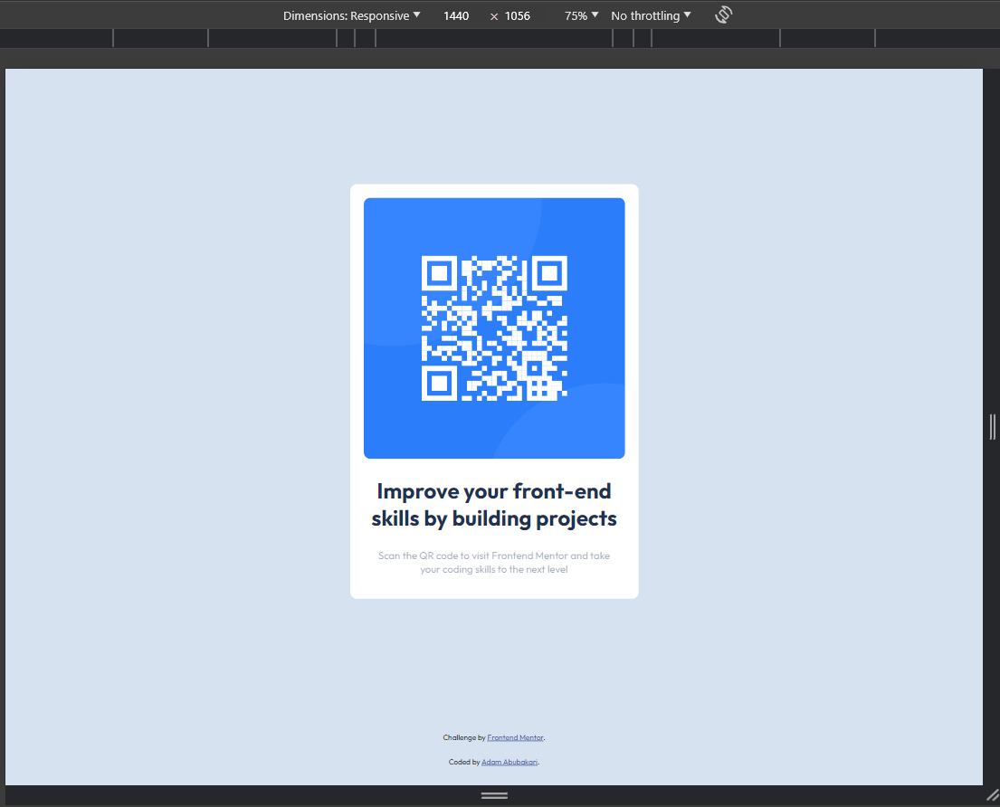

# Frontend Mentor - QR code component solution

This is a solution to the [QR code component challenge on Frontend Mentor](https://www.frontendmentor.io/challenges/qr-code-component-iux_sIO_H). Frontend Mentor challenges help you improve your coding skills by building realistic projects. 

## Table of contents

- [Overview](#overview)
  - [Screenshots](#screenshots)
- [My process](#my-process)
  - [Built with](#built-with)
  - [What I learned](#what-i-learned)
- [Author](#author)

## Overview
The designs were created to the following widths:

- Mobile: 375px
- Desktop: 1440px
Font-family used is [Outfit](https://fonts.google.com/specimen/Outfit) with weights of 400 & 700

Colours used:
- White: hsl(0, 0%, 100%)
- Light gray: hsl(212, 45%, 89%)
- Grayish blue: hsl(220, 15%, 55%)
- Dark blue: hsl(218, 44%, 22%)
- 
### Screenshots
**Desktop**

**Mobile**

## My process

### Built with

- Semantic HTML5 markup
- CSS custom properties
- Flexbox
- CSS Grid

### What I learned

Whilst this was a **very** simple start to getting back to coding there were a few thing for me to reinforce
- The use of the `box-sizing css property to remember how total area is calculated when taking padding and widths/heights into account
- Setting the root font size to 62.5% to allow for rem units to default for 10px for better

## Author

- Frontend Mentor - [@Adam-abu1](https://www.frontendmentor.io/profile/Adam-abu1)
